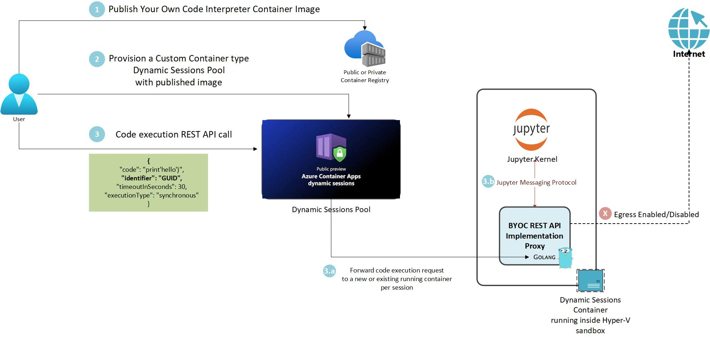

# Bring Your Own Code Interpreter (BYOC) with Custom Containers

## Overview
Azure Container Apps provides two types of [Dynamic Sessions](https://learn.microsoft.com/azure/container-apps/sessions):
1. **Code Interpreter** – Fully managed code interpreter.
2. **Custom Container** – Use your own custom container.

A more detailed comparison can be found [here](https://learn.microsoft.com/azure/container-apps/sessions?tabs=azure-cli#session-types).

Currently, built-in Code Interpreters are available for Python (General Availability) and Node.js (Preview). However, for cases where customers need more flexibility, Custom Containers offer the following advantages:

- Support for languages not available in built-in interpreters.
- Ability to run specific language versions or customized environments.
- Install private or proprietary libraries and packages for business-specific needs.
- Full control over the runtime environment.
- Advanced customization options, like scaling and exceeding certain pre-configured limits of built-in Code Interpreter based sessions pool.

Our **Bring Your Own Code Interpreter (BYOC)** capability aims to replicate the experience of code interpreter sessions using Custom Containers, enhancing the flexibility for third-party developers.

## Key Goals

The BYOC capability focuses on:
1. Simplifying the process for customers to create and deploy custom containers for use as code interpreters in Dynamic Sessions.
2. Ensuring a compatible API with built-in Code Interpreters for seamless integration with tools such as LangChain and Semantic Kernel, allowing customers to switch between interpreter types with minimal changes.

## Concepts

For an understanding of [Dynamic Sessions concepts](https://learn.microsoft.com/azure/container-apps/sessions?tabs=azure-cli#concepts), a few additional points are necessary to facilitate smooth integration with BYOC. These will help ensure a robust production setup and easy diagnostics.

The diagram below provides a high-level overview of all key concepts.

You can download Visio file from [here](./media/byoc-concepts.vsdx)

### Jupyter Kernel
A [Jupyter kernel](https://docs.jupyter.org/en/stable/projects/kernels.html) allows you to run code in a particular language using Jupyter tools like Notebooks or JupyterLab. The kernel is an application that communicates using the [Jupyter Messaging Protocol](https://jupyter-protocol.readthedocs.io/en/latest/), receiving code from the frontend and returning results.

See the [available Jupyter kernels](https://github.com/jupyter/jupyter/wiki/Jupyter-kernels) to choose one that fits your needs.

### BYOC REST API Proxy
The BYOC REST API proxy, built in Go, uses WebSocket communication with the Jupyter Kernel via the Jupyter Messaging Protocol. It manages WebSocket connections and session states, exposing simplified REST APIs that allow you to interact with the environment without handling Jupyter kernel complexities directly.

### Base BYOC Container Image
A base BYOC image is available on the [Microsoft Container Registry](https://mcr.microsoft.com/v2/k8se/services/codeinterpreter-base/tags/list) for Custom Container Dynamic Sessions. Key details:

- Built on `mcr.microsoft.com/mirror/docker/library/ubuntu:24.04`.
- Jupyter Python virtual environment located at `/home/ubuntu/snenv` under the default `ubuntu` user.
- The BYOC REST API proxy, located at `/app/goclientapp`, runs with `root` privileges.
- Common tools like `build-essential` and `wget` are pre-installed.
- Data directory at `/mnt/data` for upload/download scenarios.
- Configuration file `codeInterpreterConf.yaml` controls the behavior of the BYOC REST API proxy and requires careful configuration.

### Container Network Status
When creating a Dynamic Sessions Pool, you can set `networkStatus` to `EgressDisabled` or `EgressEnabled`. You may also specify `networkStatus` for individual code execution requests, but note that the pool-level setting will take precedence. For example, if the pool’s `networkStatus` is `EgressDisabled`, enabling it at the code execution level will still prevent internet access for that session.

### Synchronous vs. Asynchronous Code Execution
The BYOC REST API proxy maintains a single WebSocket connection for all synchronous code executions, and a unique connection for each concurrent asynchronous code execution (it is recommended to limit concurrent asynchronous executions to optimize resource usage). Many kernels do not support asynchronous code execution; some that do may require specific configuration in the BYOC configuration file.

You can specify execution type (synchronous or asynchronous) for each request as needed.

## Next Steps
- [Creating a Custom container image using base BYOC container Image](./creating-container-image.md)
- [REST API Samples](./api-samples.md)
- [Common FAQs](./FAQs.md)
- [End to end tutorials](./tutorials/README.md)
