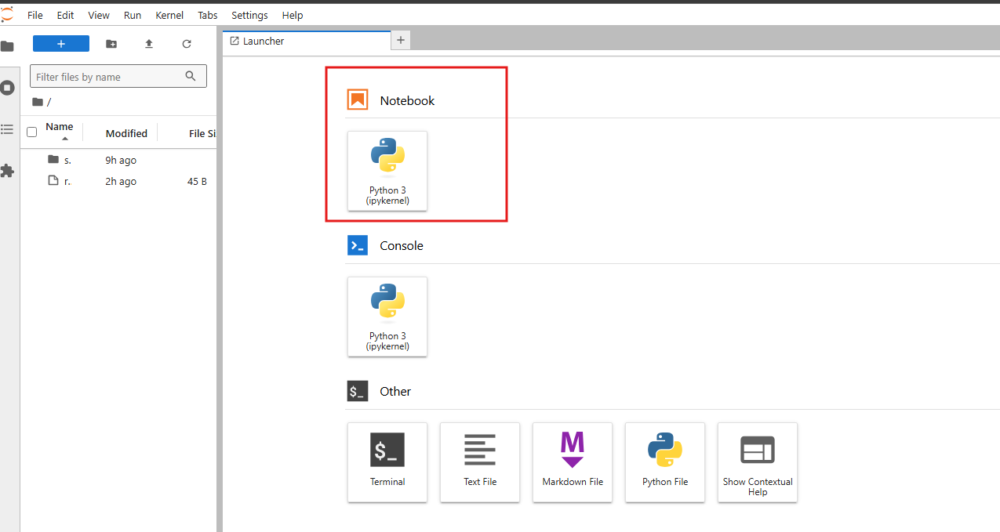

# Overview

Creating a Custom Container Dynamic Sessions pool requires setting up a custom container image. This guide provides detailed steps to build, test locally, and publish your container image to a private Azure Container Registry (ACR) or other container registries.

The [samples](./samples/README.md) directory contains example Dockerfiles that can be customized to meet your specific requirements.

## Code Interpreter Configuration

As explained in the [concepts](./README.md#concepts) section, the code interpreter configuration file controls the behavior of the BYOC REST API Proxy. Setting this file correctly is essential. The path to the configuration YAML file is specified by the `CODE_INTERPRETER_CONFIG_FILE_PATH` environment variable in the Dockerfile.

### Sample Configuration File

```yaml
kind: CodeInterpreterConfig # [Required] Must be 'CodeInterpreterConfig'
apiVersion: v1 # [Required] Must be 'v1' as of now.
metadata:
  name: code-interpreter # [Required] Must be 'code-interpreter'
spec:
  logging:
    logLevel: 1 # [Optional] Levels: 0-debug, 1-info, 2-warn, 3-error (Default: 0, Recommended: 1)
    useISO8601DateFormat: true # [Optional] true/false (Default: true, Recommended: true)
  kernel:
    name: javascript # [Required] Matches the kernel name set in Dockerfile with 'CODE_INTERPRETER_KERNEL_NAME'
    port: 6000 # [Required] Should match 'properties.ingress.targetPort' when creating the dynamic sessions pool
    isAsynchronousExecutionSupported: true # [Optional] true/false (Default: false)
  healthProbe:
    endpoint: /health # [Optional] Endpoint for health checks
    successfulHealthCheckThresholdSeconds: 120 # [Optional] Success threshold in seconds (Default: 120, Recommended: <= 120)
    initialDelaySeconds: 0    # [Optional] Initial delay for liveness checks (Default: 0, Recommended: <= 30)
    periodSeconds: 15           # [Optional] Interval between checks (Default: 15, Recommended: <= 30)
    timeoutSeconds: 15          # [Optional] Timeout for each check (Default: 15, Recommended: <= 30)
    failureThreshold: 3        # [Optional] Failures before marking container unhealthy (Default: 3, Recommended: <= 10)
    code: 1+1 # [Required] Sample health check code based on the Jupyter kernel
  codeExecution:
    enableAutoBase64Decoding: false # [Optional] Decodes base-64 encoded strings automatically (Default: true, Recommended: false)
    defaultTimeoutSeconds: 120 # [Optional] Default execution timeout (Default: 120, Recommended: <= 120)
    synchronousExecution:
      preCodeInjectionSnippet: console.time("Execution Time"); # [Optional] Pre-execution code snippet
      postCodeInjectionSnippet: console.timeEnd("Execution Time"); # [Optional] Post-execution code snippet
    asynchronousExecution:
      preCodeInjectionSnippet: $$.async() # [Optional] Pre-execution snippet for async code if kernel supports it
      postCodeInjectionSnippet: setTimeout($$.done, 120000) # [Optional] Post-execution snippet for async code
  fileOperation:
    maxUploadFileSizeLimitInMBs: 250 # [Optional] Max upload file size in MB (Default: 250, Recommended: <= 10)
    dataDirectoryPath: /mnt/data # [Optional] Path for data directory (Default: /mnt/data)
```

## Extending the Base BYOC Container Image

To create a custom container image, extend the latest BYOC base image. Details about the base image are available [here](./README.md#base-byoc-container-image).

To pull the [latest](https://mcr.microsoft.com/v2/k8se/services/codeinterpreter-base/tags/list) base image, use:

```dockerfile
FROM mcr.microsoft.com/k8se/services/codeinterpreter-base:0.0.3-ubuntu24.04
```

Organize your Dockerfile into three main sections for easier debugging and maintenance:

### Step 1: Install OS Packages as Root
Switch to the `root` user to install any required OS libraries or packages.

### Step 2: Install Jupyter Kernel as Ubuntu User
Switch to the `ubuntu` user and install the necessary Jupyter kernel in `/home/ubuntu`. Install any language-specific packages as well. Ensure `ubuntu` has permissions for newly created directories in `/home/ubuntu`.

### Step 3: Set Required Parameters as Root User
Switch back to `root` and set essential environment variables like `CODE_INTERPRETER_KERNEL_NAME`, `CODE_INTERPRETER_CONFIG_FILE_PATH`, and `ENABLE_EGRESS` to load configurations and kernels correctly.

Refer to the [samples](./samples/README.md) for example Dockerfiles.

## Building and Testing Your Custom Container Image Locally

Build and test the image locally before publishing it to a registry for use in a Dynamic Sessions Pool. If it works locally, it should work with the dynamic sessions pool, provided the configuration is correct.

### Build Container Image
Build the Docker image locally:

```shell
cd samples/python
docker build -t my-python-code-interpreter:0.0.1 -f ./Dockerfile .
```

### Run Container Image
Run the container:

```shell
docker run -p 6000:6000 -p 8888:8888 my-python-code-interpreter:0.0.1
```
- Port `6000` is for the BYOC HTTP proxy server to accept REST API requests.
- Port `8888` is for the Jupyter Kernel to allow direct Console access for debugging.

### Debug and Test Container Image
Use sample APIs, as listed [here](./api-samples.md), to validate the custom container image.

```shell
curl -v http://localhost:6000/health

< HTTP/1.1 200 OK
< Content-Type: application/json
< Content-Length: 22
{"message": "healthy"}
```

### Key Logs and Debugging Tips
- Look for logs like `Checking if the 'python3' (read from environment variable 'CODE_INTERPRETER_KERNEL_NAME') kernel is installed ...`. A success message will confirm installation.
- If you see `Token found in environment variable: <token>`, use this token to access Jupyter Notebook at `http://localhost:8888/` or JupyterLab at `http://localhost:8888/lab` to verify kernel setup.



- Logs showing health check times (`Healthcheck execution time: ...`) help verify configuration.
- Running locally emulates single-session execution, so REST API requests will land on one container regardless of the `identifier` query parameter. Each subsequent code execution may affect the state; e.g., if you declare `const foo = 1;` in one session, you cannot redeclare `foo` in a new session without restarting the container. To test ephemeral sessions, restart the container to get a fresh state, similar to a Dynamic Sessions pool setup.
- Pay close attention to log messages, as they provide valuable insights into execution behavior. The logs are designed to be self-explanatory and organized by appropriate log levels for easy interpretation.