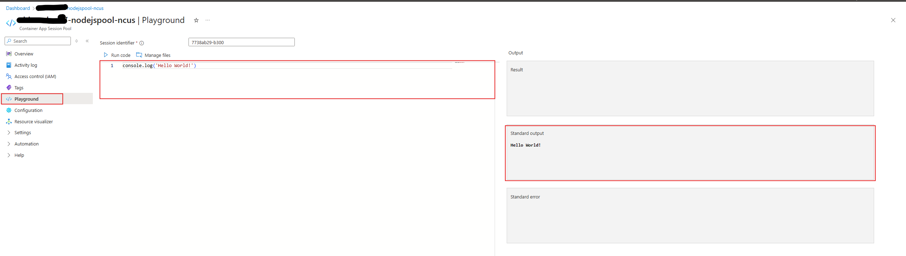

# Overview

This article provides a few Javascript code execution samples that can be useful when developing third-party code on top of the code interpreter-based Dynamic Sessions pool. While many online editors and compilers are available, or a local Node.js setup can be used to validate code correctness, running JavaScript code through the Dynamic Sessions pool, which uses a Jupyter kernel, can sometimes be challenging. 

For issues specific to Jupyter kernel behavior, refer to the [iJavaScript Jupyter Kernel documentation](https://github.com/n-riesco/ijavascript).

The best way to experiment with Javascript script samples is through the Session Pool Playground experience in the Azure Portal.



## Samples

Enter the following Javascript code snippets in the Playground to achieve the desired results.

### List Pre-installed Javascript Packages

```javascript
var { spawnSync } = require("child_process");
var result = spawnSync("npm", ["list"], { encoding: "utf-8" });

if (result.status !== 0) {
  console.error(`Standard error: ${result.stderr}`);
  console.log(`Actual output: ${result.output}`);
}

console.log(`Status: ${result.status}`);
console.log(`Standard output: ${result.stdout}`);
```

### Install Your Own Javascript Package

```javascript
var { spawnSync } = require("child_process");

var result = spawnSync("npm", ["install", "axios"], { encoding: "utf-8" });

if (result.status !== 0) {
  console.error(`Standard error: ${result.stderr}`);
  console.log(`Actual output: ${result.output}`);
}

console.log(`Status: ${result.status}`);
console.log(`Standard output: ${result.stdout}`);
```