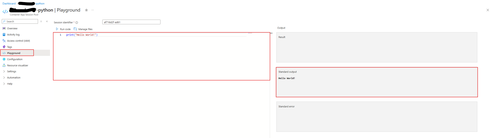

# Overview

This article provides a few Python code execution samples that can be useful when developing third-party code on top of the code interpreter-based Dynamic Sessions pool. While many online editors and compilers are available, or a local Python setup can be used to validate code correctness, running Python code through the Dynamic Sessions pool, which uses a Jupyter kernel, can sometimes be challenging. 

For issues specific to Jupyter kernel behavior, refer to the [IPython Jupyter Kernel documentation](https://ipython.readthedocs.io/en/8.27.0/config/index.html).

The best way to experiment with Python script samples is through the Session Pool Playground experience in the Azure Portal.



## Samples

Enter the following Python code snippets in the Playground to achieve the desired results.

### List Pre-installed Python Packages

```python
import pkg_resources
[(d.project_name, d.version) for d in pkg_resources.working_set]
```

### Install Your Own Python Package

```python
!pip install pillow
```