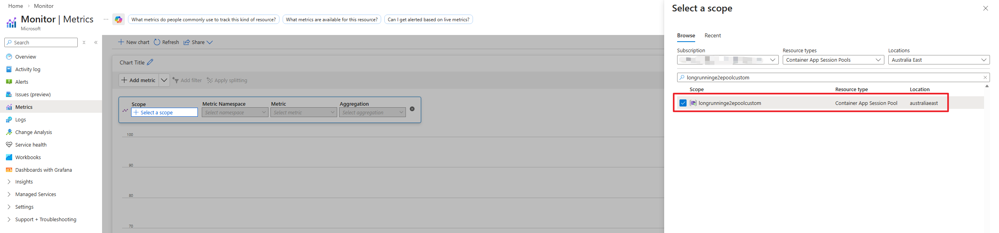
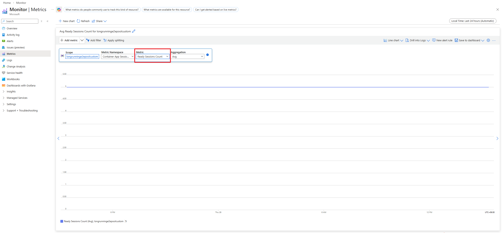
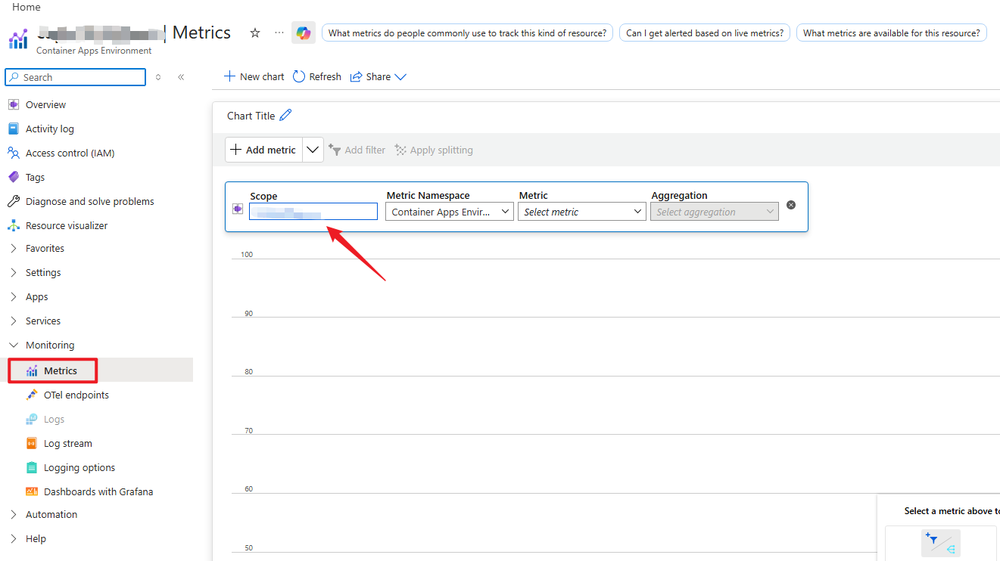

# View metrics for custom container session pools

This guide explains how to access and view metrics for your custom container session pools in Azure Container Apps dynamic sessions.

## Prerequisites

- An Azure Container Apps environment with a custom container session pool

## Supported metrics list

Here is supported metrics list. You can find more details from [Supported metrics - Microsoft.App/sessionpools - Azure Monitor | Microsoft Learn](https://learn.microsoft.com/en-us/azure/azure-monitor/reference/supported-metrics/microsoft-app-sessionpools-metrics).

| Metric | Name in REST API | Unit | Aggregation | Dimensions | Time Grains | DS Export |
| --- | --- | --- | --- | --- | --- | --- |
| **Executing Sessions Count**      Number of executing session pods in the session pool | `PoolExecutingPodCount` | Count | Total (Sum), Average, Maximum, Minimum | `poolName` | PT1M | Yes |
| **Creating Sessions Count**      Number of creating session pods in the session pool | `PoolPendingPodCount` | Count | Total (Sum), Average, Maximum, Minimum | `poolName` | PT1M | Yes |
| **Ready Sessions Count**      Number of ready session pods in the session pool | `PoolReadyPodCount` | Count | Total (Sum), Average, Maximum, Minimum | `poolName` | PT1M | Yes |

## View session metrics

### Option 1: Use Azure Monitor Metrics page

Go to [Azure Monitor Metrics page - Microsoft Azure](https://ms.portal.azure.com/#view/Microsoft_Azure_Monitoring/AzureMonitoringBrowseBlade/~/metrics), and then select your custom container session pool instance.

You can view the metrics data of specific metrics.

### Option 2: Use the metrics page of Azure Container Apps environment

Go to the metrics page of your Azure Container Apps environment and click the `Scope` to select your custom container session pool instance. And then you can view the metrics data of specific metrics.

